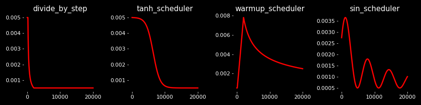

# :yum: Base Deep Learning project

The objective of this repository is to provide a base project with the `BaseModel` class with some powerful interfaces, to allow you to create new powerful and usable projects much faster !

Furthermore, all other projects (such as [Text-To-Speech](https://github.com/yui-mhcp/text_to_speech), [Speech-To-Text](https://github.com/yui-mhcp/speech_to_text), [Siamese Networks](https://github.com/yui-mhcp/siamese_networks), ...) are completely based on the `BaseModel` class. 

Note : I provide a `BaseClassifier` class as example, in order to illustrate how to subclass `BaseModel` to create a `MNIST` classifier. However, this is a really simple implementation for the `MNIST` dataset : I will later create a real `classification` repository for more advanced classification (images, text, multi-labels, ...).

Note 2 : this project tends to be as generic as possible. It is the reason why I do not provide specific architectures / generators as they are project-specific.
For instance, the `TacotronLoss` will be provided in the [tts](https://github.com/yui-mhcp/text_to_speech) project with the `Tacotron2` model / architecture.

## Project structure

```bash
├── custom_architectures/   : custom architectures
│   ├── transformers_arch/  : specific blocks for Transformers (BERT / BART / GPT-2 / ...)
├── custom_layers/          : custom layers
├── custom_train_objects/   : custom objects for training
│   ├── callbacks/          : custom callbacks
│   ├── generators/         : custom data generators
│   ├── losses/             : custom losses
│   ├── optimizers/         : custom optimizers / lr schedulers
├── datasets/               : utilities for dataset loading / processing
│   ├── custom_datasets/    : where to save custom datasets processing
├── hparams/                : utility class to define modulable hyper-parameters
├── loggers/                : some logging utilities
├── models/                 : main `BaseModel` subclasses directory
│   ├── classification/     : directory for `BaseClassifier` classes
│   ├── interfaces/         : directory for `BaseModel` class and useful interfaces\*
├── pretrained_models/      : saving directory for pretrained models
├── unitest/                : custom unitest framework to test models' consistency
└── utils/                  : utilities for data processing

```

See [my data_processing repository](https://github.com/yui-mhcp/data_processing) for more information on the `utils` module and `data processing` features, as well as `loggers` and `unitest`.

All projects also contain a `README.md` file giving general information on the project's features / usage, some links (tutorials / projects) related to the topic and some `example_*.jpynb` notebooks for practical usage examples. 

\* The *interfaces* are specific classes for text, audio and image-related models, providing many useful methods for data loading and processing. 

## Available features

- **Architectures** (module `custom_architectures`) :

| Feature   | Fuction / class   | Description |
| :-------- | :---------------- | :---------- |
| build     | `get_architecture`    | Build the required architecture (identified by its name) with all `args` and `kwargs` passed to `get_architecture`    |
| print     | `print_architectures` | Show all available architectures' names   |

- **Datasets** (module `datasets`) :

| Feature   | Fuction / class   | Description |
| :-------- | :---------------- | :---------- |
| loading   | `get_dataset` | Load a dataset identified by its name and a processing function (based on its annotation format)  |
| print     | `print_datasets`  | Show all available supported datasets' names   |
| filtering | `filter_dataset`  | Alias for `filter_df` (in `utils.pandas_utils`)   |
| `tf.data` convertion  | `build_tf_dataset`    | Build a `tf.data.Dataset` instance supporting multiple dataset format   |
| training preparation  | `prepare_dataset`     | Automatically build a dataset ready to use for training (by passing `batch_size` , `shuffle_size` , mapping functions, ...) as arguments   |
| splitting | `train_test_split`    | Split dataset supporting multiple formats |
| testing   | `test_dataset_time`   | Run the dataset and display information (batch / sec, dtypes / shapes / value ranges of a batch)   |

- **Callbacks / losses / metrics** (module `custom_train_objects`) :

| Feature   | Fuction / class   | Description |
| :-------- | :---------------- | :---------- |
| get       | `get_{callbacks / loss / metrics / optimizer}`    | Utilities to get an object / function with parameters you want based on its name  |
| show  | `print_{callbacks / loss / metrics / optimizer}`      | Show available classes' names |
| History   | `History` | main callback to track training history and configuration |
| checkpoint    | `CKPTCallback`    | Callback for `tf.train.CheckpointManager`     |
| training prediction   | `PredictorCallback`   | Callback to make prediction during training (to monitor the evolution of performances)    |
| multi-metrics | / | Metrics / losses support multi-metrics for a deeper view of training metrics (only works with the `BaseModel.train()` and not `.fit()` !) |

- **BaseModel** class :

Check the [SUBCLASSING](SUBCLASSING.md) file to have a better overview of all functions and capabilities of this class.

| Feature   | Fuction / class   | Description |
| :-------- | :---------------- | :---------- |
| build     | `_build_model`    | main function to build models             |
| compile   | `compile` | Compile models        |
| describe  | `__str__` | Show information / configuration of your model    |
| summary   | `summary` | Summary models architectures  |
| train     | `fit() / train()` | Train the model based on `tf.keras.Model.fit` method or based on a custom training loop   |
| test      | `evaluate() / test()` | Test the model based on the `tf.keras.Model.evaluate` method or based on a custom evaluation loop |
| predict   | `predict` | Base prediction method    |
| plot history  | `plot_history`    | Plot the training history |
| get dataset configuration | `get_dataset_config`  | Get dataset configuration of the model (with all the processing pipeline the model needs) |
| save      | `save`    | Save the model (its configuration, weights and history)   |
| clone     | `BaseModel.clone` | Clone a model configuration / weights (useful to fine-tune a model without modifying the original one) |

The main advantage of this class is that all `BaseModel` subclasses can be loaded without defining all its configurations again : once the model has been saved, you just need to call its class with its name and all the configuration will be loaded automatically !

Furthermore, they are all `Singleton` so you can instanciate them multiple times without reloading them.

## Available models


| Classes   | Dataset   | Architecture  | Trainer   | Weights   |
| :-------: | :-------: | :-----------: | :-------: | :-------: |
| 10        | [Fashion MNIST](https://www.tensorflow.org/datasets/catalog/fashion_mnist) | `BaseClassifier`  | [me](https://github.com/yui-mhcp) | [Google Drive](https://drive.google.com/file/d/1HNquUe648lJT3ATdSVN9Alx4I3MmRoze/view?usp=sharing)  |
| 10        | [MNIST](https://deepai.org/dataset/mnist) | `BaseClassifier`  | [me](https://github.com/yui-mhcp) | [Google Drive](https://drive.google.com/file/d/1v6Bh3ZyWck4cBujsQU3SaYTIHGiE0nal/view?usp=sharing)  |

Models must be unzipped in the `pretrained_models/` directory !

## Installation and usage

1. Clone this repository : `git clone https://github.com/yui-mhcp/base_dl_project.git`
2. Go to the root of this repository : `cd base_dl_project`
3. Install requirements\* : `pip install -r requirements.txt`
4. Open an example notebook and follow the instructions !

**For audio processing** : you should also install `ffmpeg` if you want to use some audio processing functions.

\* Some requirements are specific to functions (such as `noisereduce` is specific for noise reduction). Therefore I have put some requirements aside with the associated function : you can simply remove them if you do not want to use the function. The library is imported inside the function so that it will not raise any error ;)

## TO-DO list

- [x] Make the TO-DO list.
- [x] Make examples for dataset loading / processing.
- [x] Make examples for `BaseModel` subclassing.
- [x] Comment the `BaseModel` methods.
- [x] Comment the code.
- [x] Multi-GPU support.
- [x] Allow to call `test` with other metrics than the default ones.
- [x] Allow to call `test` multiple times in the same epoch and save all testings without overriding previous testing information.

### Future improvments

- [x] Clean some parts of the code (non audio datasets / `current_blocks.py` / `simple_models.py`) (perfectly working but quite too big). 
- [x] Add a model comparator to facilitate comparison between models architectures, training procedure and their resulting metrics. 
- [x] Clean up image / text datasets processing and add new ones. 
- [x] Improve datasets processing to make them faster with the `ThreadedQueue` utility (from `utils/thread_utils.py`). 
- [x] Add `Transformers` support\*.
- [ ] Improve the `BaseModel` class to allow new useful features (to be determined).
- [ ] Add new datasets support.

\* My objective is clearly **not** to copy or make better than the [transformers](https://github.com/huggingface/transformers) library. `Transformers` is a manly used architecture so it is important to add their support for NLP-based topics. Furthermore, my implementation is compatible with the `transformers`' checkpoints but the way they are implemented is completely different : in my approach, all models are based on the same blocks (MHA / TransformerLayer) while in `transformers`, each model has its own implementation of every sub-block.


## Supported datasets

Note that these supports are for the annotation-style of these datasets. Most of the time, multiple datasets share the same annotation mode so the functions are reusable for other datasets. 

To know the annotation-style required for each function you can see their documentation in the `datasets/custom_datasets` folder. 

- **Audio datasets** :
    - [SIWIS](https://datashare.ed.ac.uk/handle/10283/2353?show=full) dataset : french single-speaker dataset with really good quality recordings (~10k audios). 
    - [CommonVoice](https://commonvoice.mozilla.org/fr/datasets) dataset : multi-speaker dataset available for multiple language (but quite noisy so not really interesting for TTS) (~260k audios in Fr). 
    - [VoxForge](http://www.voxforge.org/) dataset : same as the CommonVoice dataset with more speakers but less audio per speaker (~20k audios). 
    - [Multilingual Large Scale (MLS)](http://www.interspeech2020.org/uploadfile/pdf/Wed-2-6-10.pdf) dataset : multi-speaker french dataset of audio-books (good quality for TTS but audio between 10 and 20s) (~260k audios). 
    - [LibriSpeech](http://www.openslr.org/12) dataset : english multi-speaker dataset from audio-books. 

- **Image datasets** :
    - [COCO](https://cocodataset.org/#home) dataset : single object detection dataset with 80 classes. 
    - [fungi](https://github.com/bolddp/fungi-machinelearning-dataset) : fungi detection dataset.
    - [Pascal VOC](http://host.robots.ox.ac.uk/pascal/VOC/) dataset : multi object detection with 20 classes. 
    - Essex dataset :  dataset for face comparison (not found the link anymore...). 
    - [Wider Face](http://shuoyang1213.me/WIDERFACE/) dataset : really good dataset for face detection in many different context, sizes and difficulties. 

- **Text datasets** :
    - [Europarl](https://www.statmt.org/europarl/) dataset : multiple corpus of datasets for translations. 
    - [The Stanford Natural Language Inference (SNLI) Corpus](https://nlp.stanford.edu/projects/snli/) : dataset for sentence meaning comparison.
    - [SQuAD 2.0](https://rajpurkar.github.io/SQuAD-explorer/) : Question-Answering dataset
    - [Semantic Text Similarity (STS) benchmark](http://ixa2.si.ehu.eus/stswiki/index.php/STSbenchmark) : score the semantic similarity of 2 sentences. 

All `tensorflow / keras` datasets are also supported by the `get_dataset()` method. 

## Training objects

- Callbacks :
    - `CKPTCallback`    : copy of the original `CheckpointCallback` of `tensorflow` but using a `tf.train.CheckpointManager` instead. It allows to have 1 callback to save multiple models (can be useful for the `GAN` architecture). 
    - `PredictorCallback`   : callback allowing to perform predictions every `n` steps to monitor training evolution. 
    - `TerminateOnNAN`  : copy of the `tensorflow` callback that raises a `ValueError` when loss is NaN. 

- Losses :
    - `CTCLoss`   : utility class that internally uses the `tf.nn.ctc_loss`. 
    - `GE2ELoss`  : tensorflow implementation of [this pytorch implementation](https://github.com/cvqluu/GE2E-Loss) which is inspired from the paper [GENERALIZED END TO END LOSS FOR SPEAKER VERIFICATION](https://arxiv.org/pdf/1710.10467.pdf). It is not really usable due to its memory cost, need to be improved (because we cannot iterate on tensors in graph mode so the implementation is quite challenging). 
    - `MaskedLosses`  : masked version of `MSE` and `MAE` losses. 

- Metrics :
    - `ConfusionMatrix`   : implementation of metrics composing the confusion matrix (TP, TN, FP, FN). This will probably be updated in future versions as `tensorflow` already provides these functions. 
    - `EER` : implementation of the `Equal Error Rate` metric based on the `AUC` metric (inspired from the `compute_eer` numpy implementation from this [StackOverflow](https://stackoverflow.com/questions/28339746/equal-error-rate-in-python)). 
    - `TextAccuracy` / `TextMetric` : metrics for text-based evaluation which computes the token-based accuracy and the sentence-based accuracy (needs to be tested but theorically working). 

- Optimizers (learning rate)* :
    - `DivideByStep`  : simple learning rate equal to an initial value divided by the current step. 
    - `WarmupScheduler`   : learning rate scheduler inspired from the [Attention is all you need](https://papers.nips.cc/paper/2017/file/3f5ee243547dee91fbd053c1c4a845aa-Paper.pdf) paper on Transformer architecture. 
    - `SinScheduler` : funny scheduler that I implemented for `GAN`'s architecture. Id did not prove its efficiency but find it funny. :smile:
    - `TanhDecayScheduler`    : decay as the `tanh` function. 



Code to generate these plots : 
```python
from utils import plot_multiple
from custom_train_objects.optimizers import *

divide = DivideByStep()
warmup = WarmupScheduler()
sin    = SinScheduler()
tanh   = TanhDecayScheduler()

# Note : you can also use the .plot(n) function of schedulers
# warmup.plot(20000)

plot_multiple(
    divide_by_step = divide, tanh_scheduler = tanh,
    warmup_scheduler = warmup, sin_scheduler = sin, 
    x = np.arange(20000), use_subplots = True, ncols = 4,
    filename = 'plot_schedulers.png'
)
```

## Extend the project

### Subclassing `BaseModel`

To see a concrete example on how to subclass it, you can look at the [BaseClassifier](models/classification/base_classifier.py) class. For instanciation, training and testing you can check [this notebook](example_mnist_classifier.jpynb).

To have a better overview of possibilities and methods you can override / use, you can check the [SUBCLASSING](SUBCLASSING.md) file. It also provides the classic methodology I use to create complete project. 

### Add new dataset

- If the dataset has a supported dataset format : 
    1. Add your dataset in the `_custom_<type>_datasets` global variable with, in the configuration, an entry `type_annots` referring to the name of dataset which has the same annotation format\*.
    2. Use it ! :smile:

- If the dataset you want to use has a different annotation format, you can add it by : 
    1. Create the processing function (which should return a `pd.DataFrame` object).
    2. Add your processing function in the `_<type>_processing_functions` global variable at the end of the file with the name of your dataset. 
    3. Add your dataset with the configuration you want in the `_custom_<type>_datasets` global variable at the end of the file. 

- If you want to add a new type of dataset, you can create a new file in `custom_datasets` and copy the general structure of other files. Do not forget to add your custom datasets / processing functions in the `__init__.py` file !

In dataset default configuration, instead of using absolute paths, you can use relative paths from a directory where you store all your datasets with the notation `{'directory' : '{}/my_dataset_name'` where `{}` is the main dataset directory which is contained in the `_dataset_dir` variable in `datasets/custom_datasets/__init__.py`.

Note that these relative paths can only be put in the dictionnary configuration and **not** in default argument in the processing function.

\* You can see an example in `datasets/custom_datasets/image_datasets.py` with the [fungi](https://github.com/bolddp/fungi-machinelearning-dataset) dataset which has the same annotation format as `COCO` : `{'type_annots' : 'coco'}`.


### Add new architecture

#### Create new model

In order to add new architecture, you just have to define it ! 
1. Create a new file in `custom_architectures/`.
2. Define your awesome custom architecture functions / classes.
3. If you create classes, do not forget to define the `get_config()` method in order to allow `tensorflow` to save your class in `json` format.
4. Create a `custom_functions` global variable dictionnary that contains as key the name of the function and as value the function itself\*.
5. If you create `tf.keras.Model` subclass or use custom layers : create a `custom_objects` global variable dictionnary which contains as key the name of your objects and as value the class itself\*\*.


Explaination : 
- The `custom_objects` is used in the `restore_models` function to allow `tensorflow` to deserialize your custom object (model or layer). 
- The `custom_functions` will define all new architectures that will be available as callable (either classes or functions). 
- The `get_config()` method of classes allows `tensorflow` to save your model configuration in order to recreate the exact same model when calling the `tensorflow.keras.models.model_from_json` function. 


\* Note that you should also put classes in this dictionnary !

\*\* You should put in this variable all custom objects (such as `tf.keras.Layer` or `tf.keras.Model`) you created and use in your model. 


#### Create new layer

In order to create a new layer, just implement it and add it to the available custom layers !
1. Create a new file in `custom_layers/` directory.
2. Do not forget to implement the `get_config()` method in order to allow `tensorflow` to serialize it in json format.
3. Add it in the `custom_layers/__init__.py` file !

When using a custom layer, do not forget to add it in the `custom_objects` of your architecture's file. 

### Add new training object (callback / lr scheduler)

It is exactly the same procedure as for creating a new layer except that you do not need to define a `get_config()` method (for the callback).
1. Define your new class in the correspondig directory.
2. Add it to the corresponding `__init__.py` file.

Note that if you create a `Callback` object, the `set_params(params)` method contains **all** the training configuration you pass to the `fit()` or `train()` call ! This is used by my custom `History` callback in order to keep track of training configuration for each training phase which can be really useful for reproductibility / comparison.

### Add new metrics / loss

It is also the same procedure but there are some particularities that I would like to emphasize.
1. Create your class in the right directory.
2. Define the `get_config()` method in order to save / restore them correctly.
3. Add it to the corresponding `__init__.py` file.

An interesting feature of this project is that it allows loss / metrics to have multiple nested metrics in order to better evaluate each aspect of loss or to avoid redundancy in metric calculation. 

For instance the `EER` metric is based on the `AUC` metric. In order to avoid computing both separatly, the `EER` returns both the `equal_error_rate` **and** the `area_under_curve` metrics. 

Another example for a loss is the `TacotronLoss` which returns the full loss but also `mel_loss`, `mel_postnet_loss` and `gate_loss` (see the `tts` project for example when available)

You can specify the `metric_names` property in metrics or `loss_names` in loss that returns the names of metrics returned.

**Warning** : this feature is only usable with the `train` method and not the `fit` one. The default behaviour in `tensorflow` is to have 1 loss / metric class per value so that all different metrics will be considered as identical (for the `EER` you will have `EER, AUC` with `train` but `EER and EER` with `fit`).

## Contacts and licence

You can contact [me](https://github.com/yui-mhcp) at yui-mhcp@tutanota.com or on [discord](https://discord.com) at `yui#0732`

The objective of these projects is to facilitate the development and deployment of useful application using Deep Learning for solving real-world problems and helping people. 
For this purpose, all the code is under the [Affero GPL (AGPL) v3 licence](LICENCE)

All my projects are "free software", meaning that you can use, modify, deploy and distribute them on a free basis, in compliance with the Licence. They are not in the public domain and are copyrighted, there exist some conditions on the distribution but their objective is to make sure that everyone is able to use and share any modified version of these projects. 

Furthermore, if you want to use any project in a closed-source project, or in a commercial project, you will need to obtain another Licence. Please contact me for more information. 

For my protection, it is important to note that all projects are available on an "As Is" basis, without any warranties or conditions of any kind, either explicit or implied. However, do not hesitate to report issues on the repository's project or make a Pull Request to solve it :smile: 

If you use this project in your work, please add this citation to give it more visibility ! :yum:

```
@misc{yui-mhcp
    author  = {yui},
    title   = {A Deep Learning projects centralization},
    year    = {2021},
    publisher   = {GitHub},
    howpublished    = {\url{https://github.com/yui-mhcp}}
}
```

## Acknowledgments

Thanks to @Ananas120 for his contribution and sharing his implementation of `Transformers` architectures. 

## Notes and references

Papers :
- [1] [GENERALIZED END TO END LOSS FOR SPEAKER VERIFICATION](https://arxiv.org/pdf/1710.10467.pdf) : original `GE2E` loss paper
- [2] [Attention is all you need](https://papers.nips.cc/paper/2017/file/3f5ee243547dee91fbd053c1c4a845aa-Paper.pdf) : original paper introducing the `WarmupScheduler` and `Transformer` architecture. 

Tutorials :
- [tensorflow's tutorials](https://tensorflow.org/tutorials) : list of tensorflow's tutorials covering many topics. Some of my projects are inspired from these tutorials as well as the `tf.data.Dataset` pipeline. 

Datasets :
- [SIWIS](https://datashare.ed.ac.uk/handle/10283/2353?show=full) dataset : french single-speaker dataset with really good quality recordings (~10k audios). 
- [CommonVoice](https://commonvoice.mozilla.org/fr/datasets) dataset : multi-speaker dataset available for multiple language (but quite noisy so not really interesting for TTS) (~260k audios in Fr). 
- [VoxForge](http://www.voxforge.org/) dataset : same as the CommonVoice dataset with more speakers but less audio per speaker (~20k audios). 
- [Multilingual Large Scale (MLS)](http://www.interspeech2020.org/uploadfile/pdf/Wed-2-6-10.pdf) dataset : multi-speaker french dataset of audio-books (good quality for TTS but audio between 10 and 20s) (~260k audios). 
- [LibriSpeech](http://www.openslr.org/12) dataset : english multi-speaker dataset from audio-books. 
- [COCO](https://cocodataset.org/#home) dataset : single object detection dataset with 80 classes. 
- [fungi](https://github.com/bolddp/fungi-machinelearning-dataset) : fungi detection dataset.
- [Pascal VOC](http://host.robots.ox.ac.uk/pascal/VOC/) dataset : multi object detection with 20 classes. 
- Essex dataset :  dataset for face comparison (not found the link anymore...). 
- [Wider Face](http://shuoyang1213.me/WIDERFACE/) dataset : really good dataset for face detection in many different context, sizes and difficulties. 
- [Europarl](https://www.statmt.org/europarl/) dataset : multiple corpus of datasets for translations. 
- [The Stanford Natural Language Inference (SNLI) Corpus](https://nlp.stanford.edu/projects/snli/) : dataset for sentence meaning comparison.
- [SQuAD 2.0](https://rajpurkar.github.io/SQuAD-explorer/) : Question-Answering dataset
- [Semantic Text Similarity (STS) benchmark](http://ixa2.si.ehu.eus/stswiki/index.php/STSbenchmark) : score the semantic similarity of 2 sentences. 

Citations : 
```
@inproceedings{panayotov2015librispeech,
  title={Librispeech: an ASR corpus based on public domain audio books},
  author={Panayotov, Vassil and Chen, Guoguo and Povey, Daniel and Khudanpur, Sanjeev},
  booktitle={Acoustics, Speech and Signal Processing (ICASSP), 2015 IEEE International Conference on},
  pages={5206--5210},
  year={2015},
  organization={IEEE}
}

@article{maclean2018voxforge,
  title={Voxforge},
  author={MacLean, Ken},
  journal={Ken MacLean.[Online]. Available: http://www.voxforge.org/home.[Acedido em 2012]},
  year={2018}
}

@article{DBLP:journals/corr/LinMBHPRDZ14,
  author    = {Tsung{-}Yi Lin and
               Michael Maire and
               Serge J. Belongie and
               Lubomir D. Bourdev and
               Ross B. Girshick and
               James Hays and
               Pietro Perona and
               Deva Ramanan and
               Piotr Doll{'{a} }r and
               C. Lawrence Zitnick},
  title     = {Microsoft {COCO:} Common Objects in Context},
  journal   = {CoRR},
  volume    = {abs/1405.0312},
  year      = {2014},
  url       = {http://arxiv.org/abs/1405.0312},
  archivePrefix = {arXiv},
  eprint    = {1405.0312},
  timestamp = {Mon, 13 Aug 2018 16:48:13 +0200},
  biburl    = {https://dblp.org/rec/bib/journals/corr/LinMBHPRDZ14},
  bibsource = {dblp computer science bibliography, https://dblp.org}
}

@misc{pascal-voc-2012,
    author = "Everingham, M. and Van~Gool, L. and Williams, C. K. I. and Winn, J. and Zisserman, A.",
    title = "The {PASCAL} {V}isual {O}bject {C}lasses {C}hallenge 2012 {(VOC2012)} {R}esults",
    howpublished = "http://www.pascal-network.org/challenges/VOC/voc2012/workshop/index.html"
}

@inproceedings{yang2016wider,
    Author = {Yang, Shuo and Luo, Ping and Loy, Chen Change and Tang, Xiaoou},
    Booktitle = {IEEE Conference on Computer Vision and Pattern Recognition (CVPR)},
    Title = {WIDER FACE: A Face Detection Benchmark},
    Year = {2016}
}


```

Note : citations for datasets are taken from [the tensorflow dataset catalog](https://www.tensorflow.org/datasets/catalog/overview) which also support these datasets but in another representation